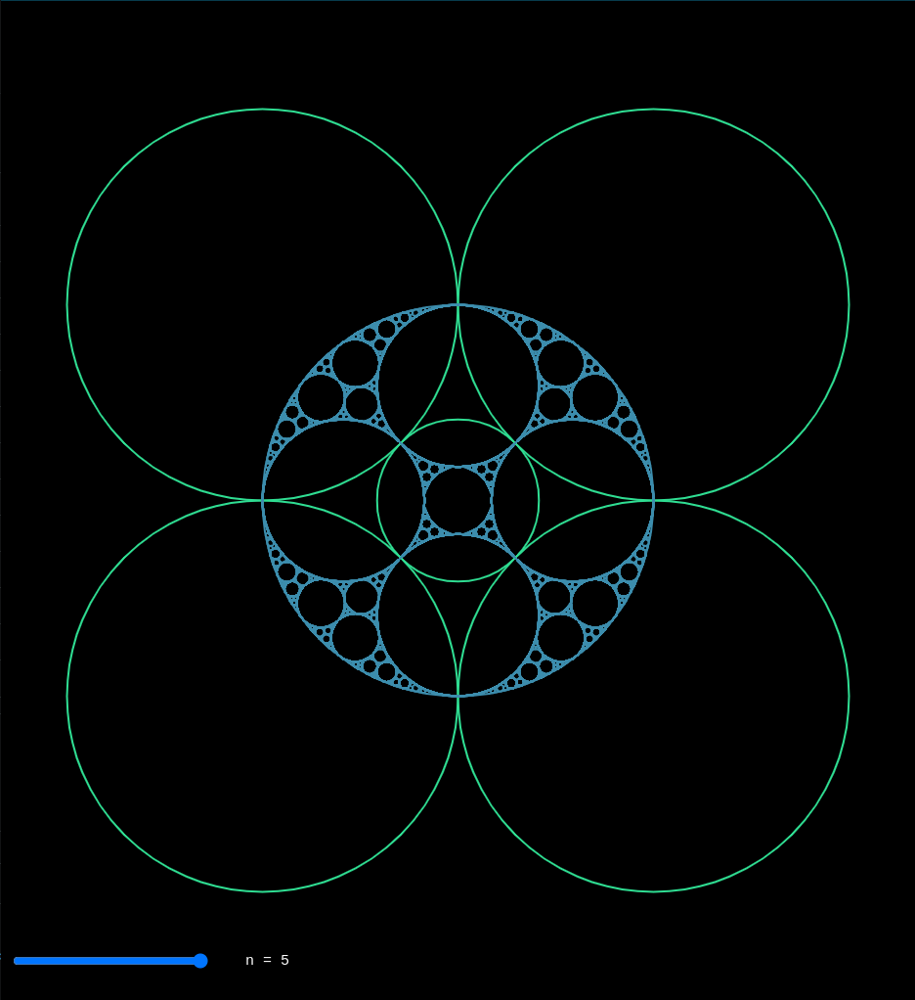
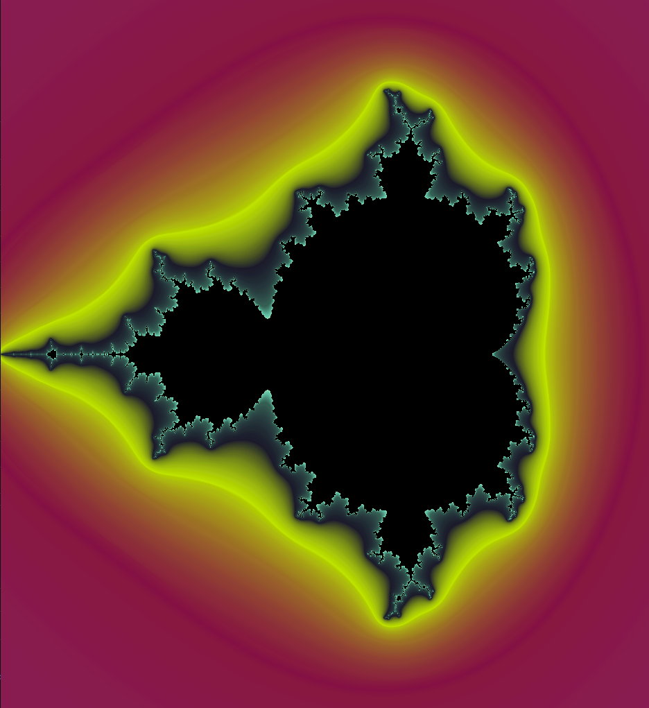
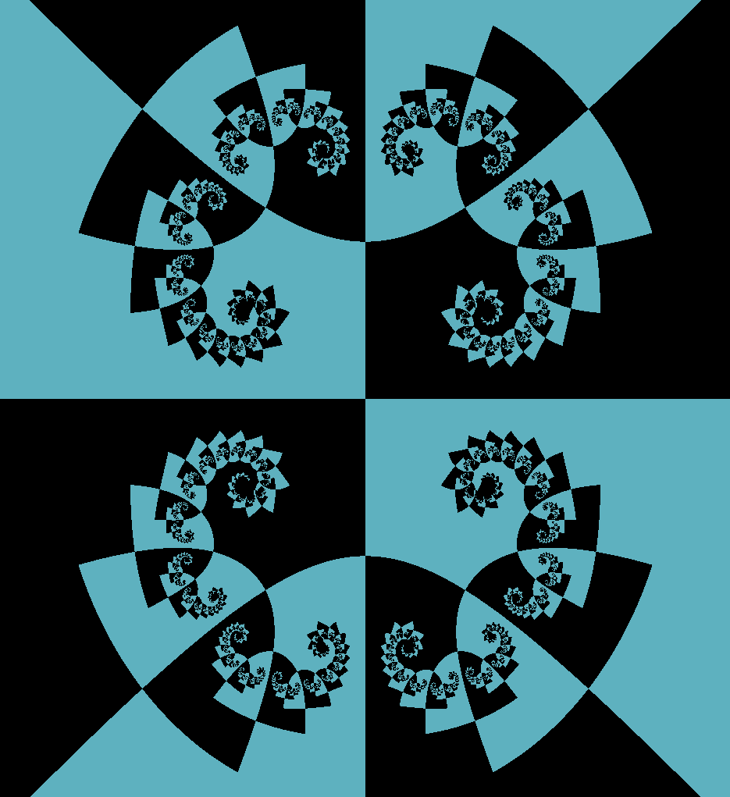
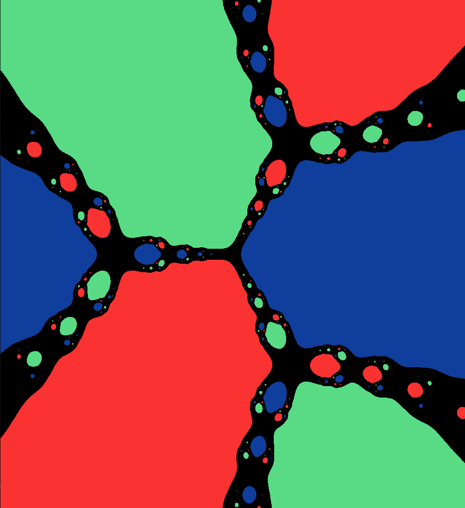
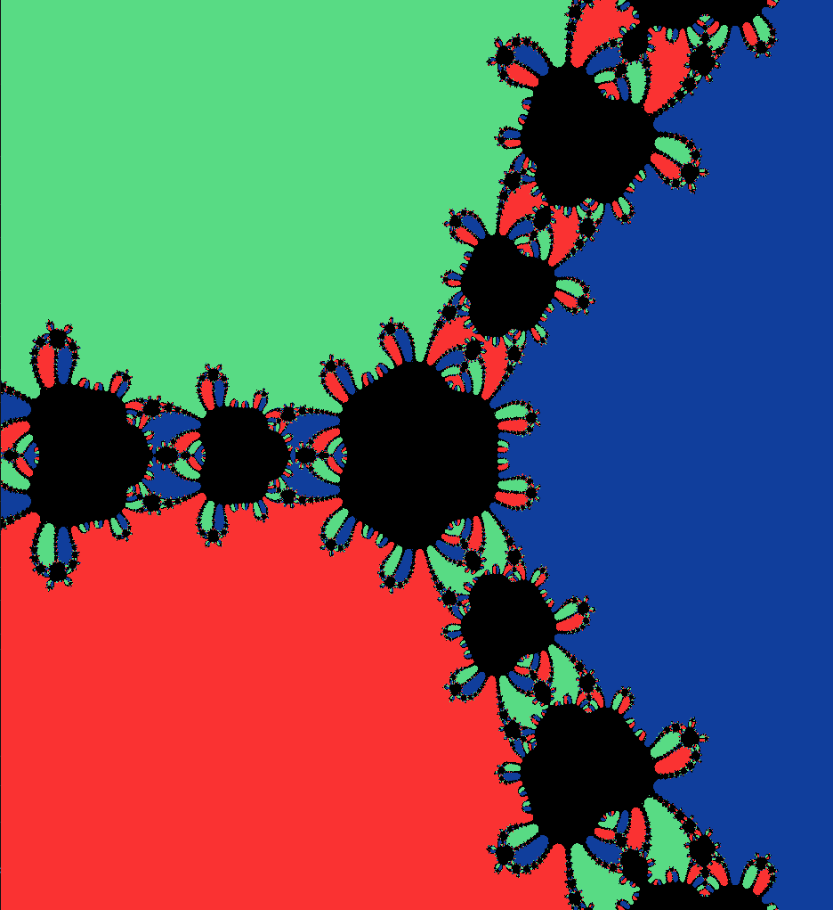
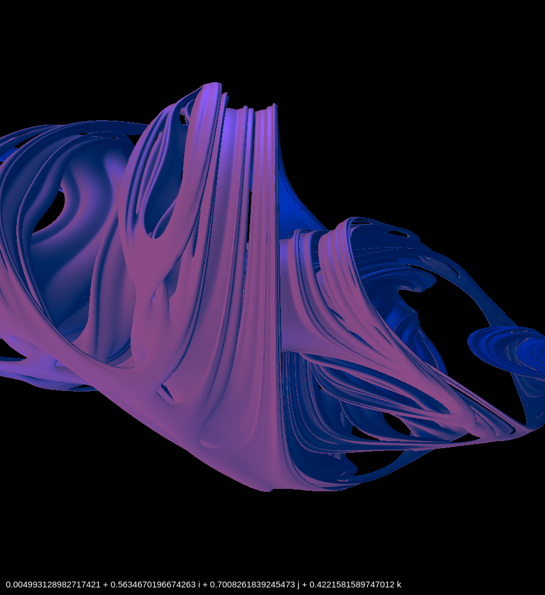

<!-- PROJECT SHIELDS -->

<!-- PROJECT LOGO -->

 

    
    <h3 align="center">Fractal Methods in Computer Graphics</h3>
    

        Class projects
         
        <a href="https://eccsx.github.io/FMiCG/">View</a>
    

<!-- ABOUT THE PROJECT -->

## About

In 2021, I had the opportunity to do an exchange semester at the University of Silesia in Katowice at the [Faculty of Science and Technology](https://us.edu.pl/wydzial/wnst/en/).

Among the proposed subjects, I decided to attend the *Fractal Methods in Computer Graphics* course, given by [Dr Krzysztof Gdawiec](https://www.researchgate.net/profile/Krzysztof-Gdawiec).
This class introduced me to fractal algorithms in the generation of aesthetic patterns.

This repository gathers all my laboratory assignments into an interactive website.

<a href="#top"><i>back to top</i></a>

### Built With

* [p5.js](https://p5js.org/)

<a href="#top"><i>back to top</i></a>

<!-- USAGE EXAMPLES -->

## Gallery

    
    
    

    
    
    

<a href="#top"><i>back to top</i></a>

<!-- LICENSE -->

## License

Distributed under the MIT License. See `LICENSE.txt` for more information.

<a href="#top"><i>back to top</i></a>

<!-- ACKNOWLEDGMENTS -->

## Acknowledgments

Meier, J. (n.d.). Mandelbrot und Julia Mengen mit Cinema 4D und Python. Retrieved March 7, 2022, from http://www.3d-meier.de/tut20/Seite1.html.

*The Phong model, introduction to the concepts of Shader, reflection models and BRDF*. Scratchapixel. (2015, July 26). Retrieved March 7, 2022, from https://www.scratchapixel.com/lessons/3d-basic-rendering/phong-shader-BRDF.

<a href="#top"><i>back to top</i></a>
